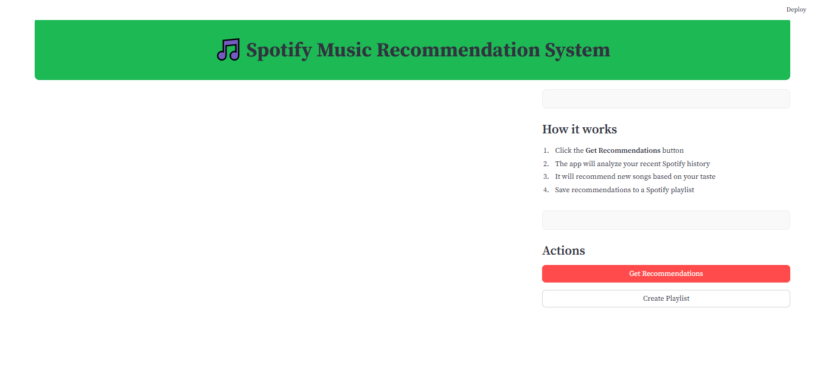
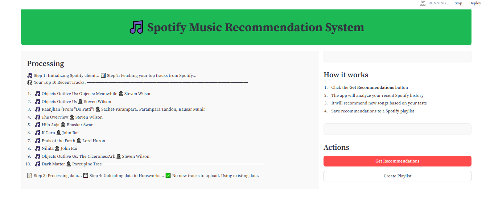
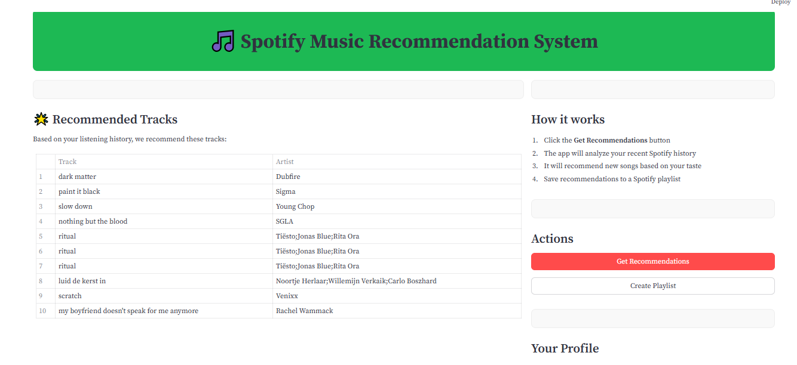
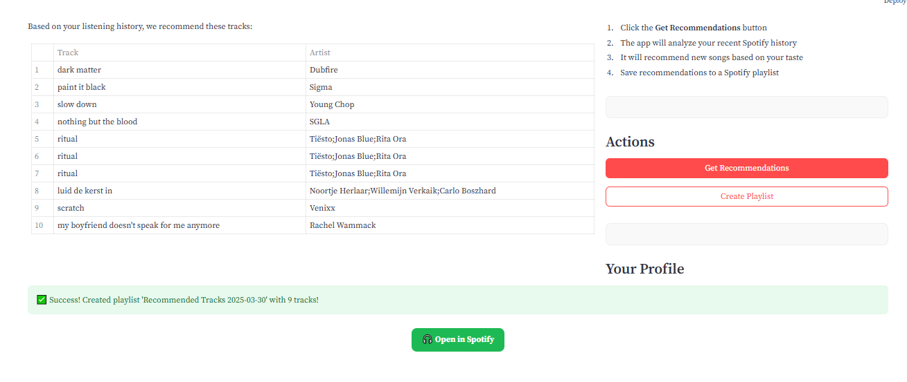

# Spotify Music Recommendation System

A personalized music recommendation application that analyzes your Spotify listening history to suggest new tracks you might enjoy.

## Overview

This application connects to your Spotify account, extracts your top 10 recently played tracks, and uses a machine learning model to generate personalized music recommendations. The system looks for patterns in your music preferences based on track popularity, artists, and track names to find songs that match your taste.

## Features

- **Spotify Integration**: Securely connect to your Spotify account
- **Listening Analysis**: View your top 10 most recently played tracks
- **Personalized Recommendations**: Get music suggestions based on your listening history
- **Playlist Creation**: Create a Spotify playlist from your recommendations with one click

## How It Works

1. **Data Collection**: The app fetches your top tracks from Spotify's API
2. **Data Processing**: Your listening data is processed and stored securely
3. **Recommendation Engine**: A K-Nearest Neighbors algorithm identifies songs similar to your favorites
4. **Playlist Creation**: Recommended songs can be saved directly to your Spotify account as a playlist

## Technology Stack

- **Frontend**: Streamlit for the user interface
- **Backend**: Python with Spotipy for Spotify API integration
- **Machine Learning**: Scikit-learn for the recommendation algorithm
- **Data Storage**: Hopsworks Feature Store for secure data management

## Installation & Setup

1. Clone this repository
   ```bash
   git clone https://github.com/yourusername/spotify-recommendation-system.git
   cd spotify-recommendation-system

2. Install dependencies:
    ```bash
    pip install -r requirements.txt

3. Create a .env file with your Spotify API credentials:
    ```bash
    SPOTIPY_CLIENT_ID=your_client_id
    SPOTIPY_CLIENT_SECRET=your_client_secret
    SPOTIPY_REDIRECT_URI=http://localhost:8888/callback
    HOPSWORKS_API_KEY=your_hopsworks_api_key

4. Run the application:
    ```bash
    streamlit run app.py




